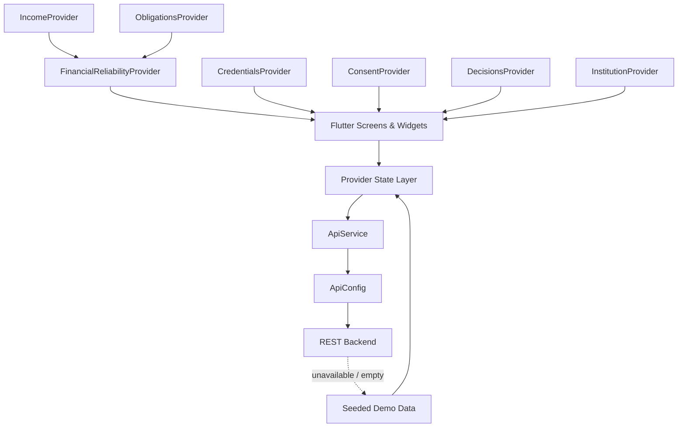

# Hive

### Verifiable Financial Identity for Informal & Thin-File Earners

Hive is a Flutter prototype that turns fragmented income, payment behavior, and recurring obligations into a **portable, explainable financial profile**.

It is designed for gig workers, freelancers, informal earners, and other people who may have real repayment capacity but limited traditional credit history.

Hive demonstrates how earnings from multiple sources can be aggregated, transformed into verifiable financial snapshots, shared with explicit consent, and reviewed by financial institutions with transparent decision reasons.

> **Prototype status**
>
> This repository is a demo/hackathon implementation. The REST API currently points to a placeholder backend, authentication and persistence are not implemented, and the app intentionally falls back to seeded demo data when APIs are unavailable.
>
> Credential hashes, institution records, WhatsApp alerts, and underwriting decisions are illustrative rather than production integrations.

---

## ✨ What Hive Does

### 1. Multi-source Income Aggregation

Hive combines fragmented earnings into a single financial view.

Supported demo sources include gig platforms, freelance marketplaces, and bank inflows.

Features include:

* Unified income ledger
* Income grouped by source
* **This week**, **This month**, and **Custom** date filters
* Stacked income visualization
* Transaction-level history
* Pull-to-refresh
* Automatic income API polling every **9 seconds** while the Dashboard is active
* Automatic fallback to realistic demo transactions when the backend is unavailable

---

### 2. Financial Reliability Profile

Hive turns cash-flow behavior into an explainable alternative financial profile.

The Dashboard tracks:

* Average monthly income
* Income consistency
* Recurring obligations
* Outstanding receivables
* On-time payment behavior
* Estimated repayment capacity
* Cash-flow trends
* A **300–900 Trust Score**

The prototype Trust Score is calculated as:

```text
weighted reliability =
    60% payment consistency
  + 40% income consistency

trust score =
    300 + (weighted reliability × 600)
```

Current score labels:

| Score   | Rating   |
| ------- | -------- |
| 780–900 | Strong   |
| 650–779 | Reliable |
| 300–649 | Building |

> The Trust Score is a prototype heuristic. It is **not** a bureau credit score and should not be used as a production lending decision by itself.

---

### 3. Verifiable Financial Credentials

Users can generate portable financial proofs based on their financial activity.

Current credential examples include:

* **Monthly Earnings Proof**
* **Rent Payment History**
* **Repayment Capacity Snapshot**

When a backend is available, Hive attempts to issue credentials through the REST API.

If the API is unavailable, the application creates a local demo credential containing:

* Credential ID
* Credential type
* Covered financial period
* Verification status
* Financial-data summary
* Demo integrity fingerprint

---

### 4. Time-limited QR Sharing

Financial credentials can be converted into temporary QR snapshots.

The generated payload contains information such as:

```text
Credential ID
Credential type
Covered period
Issued timestamp
Expiry timestamp
Verification fingerprint
Verified income snapshot
Income consistency
Payment behavior
Trust Score
```

Each share is valid for **10 minutes**.

Users can:

* Generate a QR share
* View its live expiry countdown
* Revoke it immediately
* Regenerate a new share

This demonstrates how financial data could be shared without permanently handing over an entire account history.

---

### 5. Consent-first Data Sharing

Hive gives users control over **what each institution is allowed to see**.

Access is separated into three categories:

```text
income
obligations
credentials
```

Users can grant or revoke each category independently.

For example:

```text
HDFC Bank
├── Income          ✓
├── Obligations     ✓
└── Credentials     ✓

Bajaj Finserv
├── Income          ✓
├── Obligations     ✕
└── Credentials     ✓
```

The Sharing screen also demonstrates:

* Institution-specific permissions
* Category-level consent
* Full access revocation
* Consent status
* Portable financial-profile export

Consent changes currently use optimistic local UI updates while preserving the REST API boundary for a future backend.

---

### 6. Explainable Financial Decisions

Traditional lending systems often show users only:

```text
Approved
```

or:

```text
Rejected
```

Hive adds an explainability layer through the **Why** tab.

Institution decisions can include:

* Positive factors
* Negative factors
* Structured reason categories
* Human-readable explanations
* Concrete next steps

Example:

```text
Decision: Conditional

Reason:
Only 2 months of complete linked-source history are available.

Next step:
Keep the same income sources connected for one more month.
```

The goal is to make financial decisions understandable and actionable instead of opaque.

---

### 7. Institution / Lender Portal

Hive also includes the institution side of the workflow.

The reviewer portal is accessible through:

```text
Settings → Institution / Lender Portal
```

Institutions can:

* Browse applicant profiles
* View permissioned financial information
* Inspect Trust Scores
* Review average income
* Review recurring obligations
* See repayment capacity
* Inspect income/payment consistency
* View shared credential references
* Approve or reject applications
* Attach structured decision reasons

Only information represented as shared by the applicant is presented in the reviewer experience.

---

### 8. Vernacular UI

Hive includes lightweight localization support for key application labels.

Supported languages:

* English
* हिन्दी — Hindi
* தமிழ் — Tamil
* తెలుగు — Telugu

Users can change the language from **Settings**.

Localization currently covers key Dashboard, Credentials, Sharing, Why, Settings, and navigation labels.

Some secondary text and demo content is still written directly in English.

---

### 9. Mock Notification Bridge

Settings includes a demo WhatsApp financial-alert experience.

It demonstrates how future notifications could include:

* Access changes
* Credential generation
* Consent revocation
* Financial alerts

There is currently **no real WhatsApp API integration**.

---

# 📱 Application Flow

```text
Dashboard
│
├── Multi-source income
├── Income by source
├── Unified transaction ledger
├── Cash-flow reliability
├── Obligations & receivables
├── Repayment capacity
└── Trust Score


Credentials
│
├── View financial credentials
├── Generate earnings proof
├── Inspect credential data
└── Share credential through expiring QR


Sharing
│
├── Institution consent
├── Category-level permissions
├── Revoke access
└── Export portable profile


Why
│
└── Explainable decision history
    ├── Decision
    ├── Contributing factors
    ├── Reason
    └── Next step


Settings
│
├── Language
├── Mock WhatsApp alerts
└── Institution / Lender Portal
```

---

# 🏗 Architecture



Hive uses `MultiProvider` in `lib/main.dart`.

The reliability layer uses:

```dart
ChangeNotifierProxyProvider2<
  IncomeProvider,
  ObligationsProvider,
  FinancialReliabilityProvider
>
```

This allows the Trust Score and repayment metrics to react to income and obligation data without tightly coupling the UI to calculation logic.

---

# 🛠 Tech Stack

| Area             | Technology                   |
| ---------------- | ---------------------------- |
| Framework        | Flutter                      |
| Language         | Dart                         |
| UI               | Material                     |
| State management | `provider`                   |
| Networking       | `http`                       |
| QR generation    | `qr_flutter`                 |
| Platforms        | Android, iOS, Web            |
| Backend          | REST interface / placeholder |
| Offline demo     | Seeded provider data         |

Key dependencies from `pubspec.yaml`:

```yaml
provider: ^6.1.2
http: ^1.2.2
qr_flutter: ^4.1.0
```

---

# 🚀 Getting Started

## Prerequisites

Install Flutter with a Dart version compatible with:

```text
Dart >= 3.2.0 < 4.0.0
```

You will also need the standard tooling for the platform you want to run.

Examples:

* Android Studio + Android SDK for Android
* Xcode for iOS
* Chrome for Flutter Web

---

## Clone the Repository

```bash
git clone <your-repository-url>
cd hive
```

---

## Install Dependencies

```bash
flutter pub get
```

---

## Run the Application

```bash
flutter run
```

For Flutter Web:

```bash
flutter run -d chrome
```

Useful development checks:

```bash
flutter analyze
flutter test
```

---

# 🔌 Backend Integration

Backend configuration is centralized in:

```text
lib/core/constants/api_config.dart
```

The current API URL is intentionally a placeholder:

```dart
static const String baseUrl =
    'https://api.example-vfid.dev';
```

Replace it with your backend before enabling real integrations.

---

## REST API Surface

| Method | Endpoint                         | Purpose                          |
| ------ | -------------------------------- | -------------------------------- |
| `GET`  | `/v1/income/sources`             | Fetch connected income sources   |
| `POST` | `/v1/income/sync`                | Trigger income synchronization   |
| `GET`  | `/v1/income/transactions`        | Fetch aggregated transactions    |
| `GET`  | `/v1/obligations`                | Fetch recurring obligations      |
| `GET`  | `/v1/receivables`                | Fetch expected receivables       |
| `GET`  | `/v1/credentials`                | Fetch financial credentials      |
| `POST` | `/v1/credentials/issue`          | Issue a credential               |
| `GET`  | `/v1/credentials/{id}/verify`    | Credential verification endpoint |
| `GET`  | `/v1/consent/grants`             | Fetch consent grants             |
| `POST` | `/v1/consent/grant`              | Create/update consent            |
| `POST` | `/v1/consent/{id}/revoke`        | Revoke consent                   |
| `GET`  | `/v1/institution/decisions`      | Fetch institution decisions      |
| `GET`  | `/v1/institution/decisions/{id}` | Fetch an individual decision     |

`ApiService` is intentionally kept thin.

Its responsibilities are primarily:

```text
Build URL
    ↓
Perform HTTP request
    ↓
Decode JSON
    ↓
Convert JSON into app models
    ↓
Return data to Provider
```

Authentication has deliberately been left as a TODO.

A future implementation could attach authorization inside:

```dart
Map<String, String> get _headers => {
  'Content-Type': 'application/json',
  'Authorization': 'Bearer <token>',
};
```

Production credentials or API tokens should **not** be hard-coded in the repository.

---

# 🧪 Demo Fallback Mode

Most feature providers start with representative demo data.

This means Hive remains usable even when no backend exists.

```text
        API request
            │
            ▼
    ┌─────────────────┐
    │ Usable response?│
    └────────┬────────┘
             │
       ┌─────┴─────┐
      Yes          No
       │            │
       ▼            ▼
 Use live data   Keep seeded
                demo state
```

Examples of fallback data include:

* Gig-platform income transactions
* Freelance payments
* Bank inflows
* Rent and EMI obligations
* Outstanding client receivables
* Credentials
* Consent relationships
* Institution decisions
* Applicant profiles

This behavior is useful for demonstrations.

A production build should instead implement explicit:

* Authentication states
* Retry behavior
* Offline states
* Error messages
* Persistence
* Loading states
* Server synchronization

---

# 📂 Project Structure

```text
lib/
├── main.dart
│
├── core/
│   ├── constants/
│   │   └── api_config.dart
│   │
│   ├── localization/
│   │   └── app_localizations.dart
│   │
│   └── theme/
│       ├── app_colors.dart
│       ├── app_spacing.dart
│       ├── app_text_styles.dart
│       └── app_theme.dart
│
├── models/
│   ├── app_notification.dart
│   ├── consent_grant.dart
│   ├── credential.dart
│   ├── income_source.dart
│   ├── institution_applicant.dart
│   ├── institution_decision.dart
│   ├── obligation.dart
│   ├── receivable.dart
│   ├── transaction.dart
│   └── models.dart
│
├── providers/
│   ├── app_notifications_provider.dart
│   ├── app_state_provider.dart
│   ├── consent_provider.dart
│   ├── credentials_provider.dart
│   ├── decisions_provider.dart
│   ├── financial_reliability_provider.dart
│   ├── income_provider.dart
│   ├── institution_provider.dart
│   ├── language_provider.dart
│   └── obligations_provider.dart
│
├── screens/
│   ├── credentials/
│   ├── dashboard/
│   ├── institution/
│   ├── settings/
│   ├── sharing/
│   ├── shell/
│   └── why/
│
├── services/
│   └── api_service.dart
│
└── widgets/
    ├── app_card.dart
    ├── empty_state.dart
    ├── loading_shimmer.dart
    ├── primary_button.dart
    ├── section_header.dart
    └── trust_score_gauge.dart
```

---

# 🧠 State Management

The application separates features into dedicated providers.

### `IncomeProvider`

Responsible for:

* Income transactions
* Date filtering
* Source aggregation
* Chart buckets
* Backend refreshes
* Dashboard-only polling

### `ObligationsProvider`

Responsible for:

* Recurring obligations
* Receivables
* Monthly commitments
* Outstanding receivables
* On-time payment rate

### `FinancialReliabilityProvider`

Derives:

* Income consistency
* Payment consistency
* Repayment capacity
* Obligation load
* Trust Score
* Reliability label

### `CredentialsProvider`

Handles:

* Credential loading
* Credential generation
* QR generation
* 10-minute share expiry
* QR revocation
* QR regeneration

### `ConsentProvider`

Handles:

* Institution permissions
* Per-category data sharing
* Consent updates
* Full revocation

### `DecisionsProvider`

Maintains:

* Institution decision history
* Positive factors
* Adverse factors
* Explainability reasons
* Applicant next steps

### `InstitutionProvider`

Powers the reviewer-side demo:

* Applicant list
* Permissioned applicant profiles
* Approval/rejection decisions
* Structured decision reasons

### `LanguageProvider`

Controls the currently selected app language.

---

# ⚠️ Current Limitations

This repository is intentionally a prototype.

Important implementation details include:

* There is currently **no real production backend**.
* API URLs point to a placeholder domain.
* No production authentication flow exists.
* App state is not persisted between launches.
* Demo data is retained when endpoints fail.
* Institution applicants are stored in memory.
* Reviewer decisions are stored in memory.
* QR payloads are local JSON snapshots.
* Credential fingerprints are demo integrity values.
* No standards-based verifiable presentation protocol is implemented yet.
* Weekly/monthly cash-flow chart values are currently demo series.
* Live transactions can affect income consistency, but do not yet rebuild every reliability chart series.
* WhatsApp notifications are mocked.
* Localization currently covers only key user-facing labels.
* API failures are intentionally suppressed in several demo providers to keep the prototype usable.

---

# 🗺 Production Roadmap

Before Hive could become a production financial-identity platform, the main next steps would be:

1. **Real backend integration**

   * Replace placeholder endpoints
   * Add authentication
   * Add user/session management

2. **Secure data storage**

   * Encrypted local storage
   * Secure token handling
   * Proper account lifecycle management

3. **Real verifiable credentials**

   * Cryptographically signed credentials
   * Issuer verification
   * Credential revocation
   * Server-side verification
   * Standards-based presentations

4. **Auditable consent**

   * Server-side consent records
   * Permission expiry
   * Revocation verification
   * Consent history
   * Audit logs

5. **Validated financial reliability**

   * Fully live cash-flow calculations
   * Longer financial history
   * Independently reviewed scoring logic
   * Explainability testing
   * Bias/fairness evaluation

6. **Institution integrations**

   * Real applicant records
   * Permission-bound institution access
   * Decision APIs
   * Reviewer authentication

7. **Reliable application states**

   * Network error handling
   * Retries
   * Offline state
   * Sync indicators
   * Background refresh strategy

8. **Complete localization**

   * Move every user-facing string into localization resources
   * Add language-specific formatting

9. **Real notifications**

   * WhatsApp/SMS/push provider integration
   * User notification preferences
   * Delivery tracking

10. **Testing & security**

    * Unit tests
    * Widget tests
    * Integration tests
    * API contract tests
    * Privacy review
    * Threat modeling
    * Security testing

---

# 🎯 Intended Use

Hive is currently useful for demonstrating ideas around:

* Alternative credit assessment
* Gig-worker financial identity
* Freelancer income verification
* Thin-file borrower onboarding
* Multi-source income aggregation
* Consent-driven financial data sharing
* Portable financial credentials
* Explainable lending decisions
* Repayment-capacity assessment

It is **not**, in its current form, a production:

* Credit bureau
* KYC platform
* Regulated underwriting engine
* Financial advice system
* Cryptographic verifiable-credential infrastructure

---

## Hive

**Turning fragmented earning history into a financial identity the user can understand, control, and share.**
